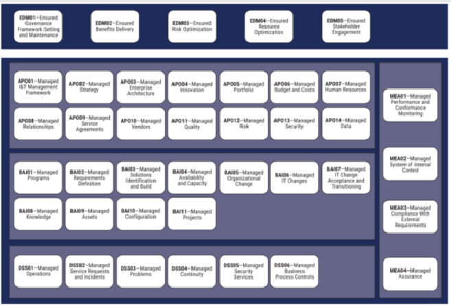

https://www.youtube.com/watch?v=FOTX77uZwfY&pp=ygUKY29iaXQgMjAxOQ%3D%3D

De valkuil van de snelle cloud-start

Het is tegenwoordig een bekend scenario binnen veel IT-afdelingen: de overstap naar de cloud begint klein en enthousiast. Met een creditcard en een paar muisklikken is een testomgeving zo opgezet in Microsoft Azure of AWS. In het begin lijkt alles soepel te lopen, maar naarmate de omgeving binnen de organisatie groeit, ontstaan er bijna altijd problemen. We zien dan dat servers onnodig blijven aanstaan, dat er veel te zware 'instance types' worden gekozen en dat de maandelijkse kosten onbeheersbaar worden. Ook op het gebied van beveiliging gaat het vaak mis. Een klassiek voorbeeld is de werknemer die uit dienst treedt, maar maanden later nog steeds toegang heeft tot bedrijfskritieke systemen simpelweg omdat niemand wist wie verantwoordelijk was voor het intrekken van die rechten.

Deze problemen zijn geen technisch falen, maar een gebrek aan governance. Governance gaat niet over het vertragen van innovatie met regeltjes, maar over het inrichten van een systeem dat ervoor zorgt dat de IT-afdeling niet "zomaar wat doet", maar keuzes maakt die veilig zijn en passen bij het budget van het bedrijf. Tijdens deze les heb ik onderzoek gedaan naar het framework COBIT 2019. In dit document leg ik uit wat dit framework precies is, hoe het helpt bij het beheren van de cloud en hoe de grote cloudproviders hiermee omgaan.
Wat is COBIT 2019 voor een standaard?

COBIT staat voor Control Objectives for Information and Related Technologies. Het is een wereldwijd erkend raamwerk dat organisaties helpt bij het aansturen en beheren van hun IT. Je kunt het eigenlijk zien als de "spelregels" van een organisatie voor alles wat met techniek te maken heeft. Het is geen technische handleiding die je vertelt welk knopje je moet indrukken, maar een strategisch model dat helpt om de doelen van het bedrijf te verbinden met de uitvoering door de IT-afdeling.

Het belangrijkste kenmerk van de 2019-versie van COBIT is het strikte onderscheid tussen 'Governance' en 'Management'. Governance is de taak van de directie; zij bepalen de koers, kijken naar de risico's en controleren of investeringen hun geld wel waard zijn. Management is de taak van de IT-afdeling; zij bouwen en onderhouden de systemen die nodig zijn om de koers van de directie te volgen. In de cloud is dit onderscheid cruciaal, omdat de verantwoordelijkheid voor de fysieke hardware bij de provider ligt, waardoor de interne organisatie zich volledig moet focussen op de juiste sturing en controle.

Wanneer we COBIT 2019 toepassen op een cloud-omgeving, zien we direct hoe het helpt om de chaos te voorkomen. COBIT kijkt namelijk veel verder dan alleen de techniek. Het richt zich op zeven 'componenten' die samen een goed systeem vormen: processen, organisatiestructuren, principes, informatie, cultuur, mensen en natuurlijk de techniek zelf.

Neem bijvoorbeeld het probleem van de kostenbeheersing. Binnen COBIT valt dit onder het domein 'Managed Costs'. In plaats van achteraf te schrikken van de rekening, dwingt het framework je om vooraf processen in te richten. Er moet bijvoorbeeld een afspraak zijn dat een developer niet zomaar de duurste servers kan aanzetten zonder goedkeuring van iemand die het budget beheert. Ook op het gebied van mensen en hun toegang (identity management) biedt COBIT een oplossing. Het zorgt ervoor dat de afdeling HR (personeelszaken) direct gekoppeld is aan de IT-afdeling. Zodra een contract stopt, gaat er automatisch een proces lopen dat alle cloud-accounts blokkeert. Zo voorkom je beveiligingslekken door menselijke fouten of vergeten accounts.
Is het framework compleet?

Een belangrijke vraag is of COBIT 2019 alle aspecten van governance afdekt. In de context van enterprise IT is het antwoord: ja. COBIT is extreem uitgebreid. Het behandelt alles vanaf de eerste investering tot aan het dagelijkse beheer en de uiteindelijke beveiliging van data. Omdat het ook kijkt naar de bedrijfscultuur en de vaardigheden van de medewerkers, blijven er weinig blinde vlekken over.

Toch is er een nuance nodig. Hoewel COBIT strategisch compleet is, is het technisch gezien een "leeg" frame. Het vertelt je wat je moet bereiken (bijvoorbeeld: "zorg dat je data veilig is opgeslagen"), maar het vertelt je niet hoe je dat technisch doet in de Azure-portal of de AWS-console. Je hebt dus altijd technische standaarden nodig om COBIT in te vullen. COBIT is de baas die zegt wat er moet gebeuren, en technische standaarden zoals ISO 27001 of ITIL zijn de gereedschappen die het werk uitvoeren. Die combinatie maakt het geheel pas echt werkbaar voor een moderne IT-organisatie.
Kritische blik: Sterke en minder goede punten

Als HBO-student moet je ook kritisch durven kijken naar zulke grote modellen. Het sterkste punt van COBIT 2019 is de enorme flexibiliteit. Dankzij de zogenaamde 'Design Factors' kun je het framework precies op maat maken voor jouw organisatie. Een kleine cloud-startup hoeft niet alle 40 doelstellingen te gebruiken; zij kiezen alleen de onderdelen die voor hen belangrijk zijn. Daarnaast zorgt COBIT ervoor dat IT eindelijk dezelfde taal spreekt als de directie, wat de communicatie over budgetten en risico's veel makkelijker maakt.

Het grootste nadeel is echter de complexiteit. De documentatie van ISACA is taai, abstract en staat vol met vakjargon. Voor een beginnende IT-er of een klein bedrijf is het vaak lastig om te begrijpen waar je moet beginnen. Bovendien kan het implementeren van alle regeltjes leiden tot een enorme bureaucratie. In de cloud wil je juist snel kunnen schakelen (Agile werken), en te veel governance kan dan voelen als een rem op de innovatie. Het vinden van de juiste balans tussen controle en snelheid is de grootste uitdaging bij COBIT.
De rol van public cloud providers

Wat doen de grote jongens zoals Microsoft en Amazon eigenlijk met deze standaard? Hoewel zij hun eigen platforms natuurlijk op hun eigen manier beheren, doen ze er alles aan om het hun klanten makkelijk te maken om aan COBIT te voldoen.

Cloudproviders conformeren zich niet direct aan COBIT als ware het een wet, maar zij leveren wel de tools die nodig zijn om de COBIT-doelen te halen. Microsoft heeft bijvoorbeeld 'Azure Policy' en 'Blueprints'. Hiermee kun je regels instellen die precies passen bij de eisen die COBIT stelt. Ook publiceren ze 'Compliance Mappings'. Dit zijn documenten waarin ze per COBIT-regel uitleggen welke knop of tool in de cloud je moet gebruiken om daaraan te voldoen. Ze nemen de governance niet van je over, maar ze geven je wel het gereedschap om het volgens de regels in te richten. Dit past perfect in het 'Shared Responsibility Model': de provider is verantwoordelijk voor de cloud, maar jij bent verantwoordelijk voor de governance in de cloud.
Conclusie

COBIT 2019 is een onmisbaar instrument voor elke organisatie die serieus werk wil maken van cloud-beheer. Het voorkomt dat IT een onbeheerste kostenpost wordt en zorgt ervoor dat veiligheid een vast onderdeel is van de bedrijfsvoering. Hoewel de abstracte taal soms een drempel vormt, biedt de integrale aanpak een enorme meerwaarde om de kloof tussen techniek en business te overbruggen.
Bronvermelding

    ISACA. (2018). COBIT 2019 Framework: Introduction and Methodology. Geraadpleegd via de officiële ISACA-documentatie.

    Pink Elephant. (2019). White Paper: COBIT 2019 – Wat is er nieuw? Geraadpleegd via pinkelephant.nl.

    Microsoft. (2024). Cloud Adoption Framework (CAF) voor Azure. Geraadpleegd via learn.microsoft.com.